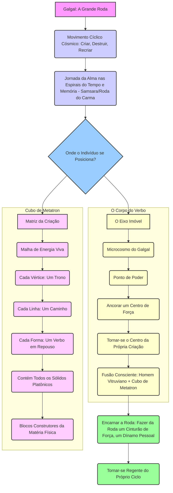

Compreendido. Procederei com a criação dos gráficos e tabelas solicitados, focando na integração e clareza das informações, conforme as instruções e materiais de referência fornecidos.

---

## Desenvolvimento de Gráficos e Tabelas Fundamentais para o "Corpo do Verbo" e "Zorar Operativo"

A seguir, são apresentados os gráficos e tabelas que visam consolidar e visualizar os conceitos centrais dos métodos "O Corpo do Verbo" e "Zorar Operativo", abordando a Árvore da Vida, as letras hebraicas e o Cubo de Metatron.

### 1. Diagrama da Árvore da Vida com Mapeamento Somático

A Árvore da Vida, um conceito central na Cabala, é aqui mapeada ao corpo humano, conforme a perspectiva do método "O Corpo do Verbo". Este mapeamento somático conecta as Sefirot (emanações divinas) a pontos específicos do corpo físico, transformando o corpo em um "Grimório Vivo do Verbo" e um "Barômetro da Alma".

**Conceito:** O corpo não é uma prisão, mas um templo onde o Verbo se manifesta. As sensações corporais são "dados" que a alma comunica através da carne, permitindo autoconhecimento e cura.

**Mapeamento Somático da Árvore da Vida:**

| Sefirá (Emanação) | Localização Somática (Corpo Humano) | Significado/Função no Contexto do "Corpo do Verbo" |
|---|---|---|
| **Keter (Coroa)** | Acima da cabeça / Coroa | Conexão com o Divino, Vontade Primordial, Ponto de Essência. |
| **Chokmah (Sabedoria)** | Lado direito do cérebro / Hemisfério direito | Sabedoria intuitiva, insights, potencial criativo. |
| **Binah (Entendimento)** | Lado esquerdo do cérebro / Hemisfério esquerdo | Entendimento, lógica, estrutura, forma. |
| **Chesed (Misericórdia/Amor)** | Braço direito / Lado direito do tronco | Expansão, bondade, amor incondicional. |
| **Gevurah (Julgamento/Força)** | Braço esquerdo / Lado esquerdo do tronco | Restrição, disciplina, força, discernimento. |
| **Tiferet (Beleza/Harmonia)** | Coração / Centro do peito | Equilíbrio, compaixão, beleza, integração. |
| **Netzach (Vitória/Eternidade)** | Perna direita / Quadril direito | Persistência, vitória, emoção, instinto. |
| **Hod (Glória/Esplendor)** | Perna esquerda / Quadril esquerdo | Intelecto, comunicação, razão, lógica. |
| **Yesod (Fundamento)** | Órgãos genitais / Base da coluna | Fundação, reprodução, inconsciente, memória. |
| **Malchut (Reino)** | Pés / Base do corpo | Manifestação, realidade física, ancoragem. |

*Nota: Este diagrama é uma representação conceitual. A profundidade da correspondência somática pode variar e é explorada nas práticas do "Zorar Operativo".*

### 2. Tabela de Correspondências entre as 22 Letras Hebraicas e Pontos Corporais

As 22 letras do alfabeto hebraico são consideradas no método "O Corpo do Verbo" como "letras-funções" ou forças arquetípicas que constroem a realidade. No "Zorar Operativo", as "práticas somáticas" ativam o Corpo do Verbo conectando essas letras a pontos de poder no corpo físico.

**Conceito:** Cada letra hebraica possui uma vibração e um significado que ressoam com uma parte específica do corpo, permitindo a ativação e o alinhamento energético através de exercícios práticos.

| Letra Hebraica | Nome da Letra | Ponto Corporal Associado (Exemplos) | Função/Significado no Corpo do Verbo |
|---|---|---|---|
| א | Alef | Peito / Respiração | Unidade, Ar, Início, Silêncio, Expansão. |
| ב | Bet | Boca / Fala | Casa, Criação, Dualidade, Manifestação. |
| ג | Guimel | Garganta / Pescoço | Ponte, Conexão, Movimento, Recompensa. |
| ד | Dalet | Mão / Porta | Porta, Entrada, Pobreza, Doação. |
| ה | Hei | Olhos / Visão | Janela, Revelação, Respiração, Expansão. |
| ו | Vav | Coluna Vertebral / Conexão | Gancho, Conexão, União, Ligação. |
| ז | Zain | Pés / Caminhada | Espada, Armadura, Sustento, Movimento. |
| ח | Chet | Coração / Sentimentos | Cerca, Vida, Limite, Proteção. |
| ט | Tet | Útero / Abdômen | Serpente, Bem, Gestação, Oculto. |
| י | Yod | Mãos / Dedos | Mão, Ponto, Semente, Potencial. |
| כ | Kaf | Palma da Mão / Força | Palma, Poder, Abertura, Permissão. |
| ל | Lamed | Rins / Aprendizado | Aguilhão, Aprendizado, Ensinamento. |
| מ | Mem | Água / Fluxo Sanguíneo | Água, Mãe, Fluidez, Caos Primordial. |
| נ | Nun | Nervos / Flexibilidade | Peixe, Semente, Continuidade, Queda. |
| ס | Samech | Baço / Suporte | Suporte, Círculo, Confiança, Proteção. |
| ע | Ain | Olho / Percepção | Olho, Fonte, Percepção, Humildade. |
| פ | Pe | Boca / Expressão | Boca, Fala, Expressão, Abertura. |
| צ | Tsadi | Pulmões / Respiração | Justo, Caça, Humildade, Retidão. |
| ק | Kof | Nuca / Conexão Superior | Nuca, Macaco, Santidade, Atrás. |
| ר | Resh | Cabeça / Razão | Cabeça, Início, Pobreza, Escolha. |
| ש | Shin | Dentes / Fogo | Dente, Fogo, Transformação, Mudança. |
| ת | Tav | Coração / Selo | Cruz, Sinal, Selo, Verdade, Conclusão. |

*Nota: As correspondências são baseadas nos princípios da Cabala e na interpretação do "Corpo do Verbo", podendo haver variações em outras tradições.*

### 3. Infográfico do Cubo de Metatron e sua Relação com o "Galgal"

O Cubo de Metatron é uma figura de Geometria Sagrada que contém todas as formas existentes no universo, sendo os blocos construtores de toda a matéria física (Sólidos Platônicos). No contexto do blog "Kabbalah das Águas Primordiais", ele é a "matriz da criação", uma "malha de energia viva". O "Galgal" (גלגל), por sua vez, é a "Grande Roda", o arquétipo do movimento cíclico cósmico.

**Conceito:** O Cubo de Metatron representa a estrutura do macrocosmo divino, enquanto o "Corpo do Verbo" é o "Eixo Imóvel" no centro do "Galgal", o microcosmo que permite ao indivíduo comandar seu próprio ciclo. A fusão consciente do Homem Vitruviano (microcosmo humano) e do Cubo de Metatron (macrocosmo divino) é o "Corpo Cubal do Verbo".

**Infográfico Conceitual: Cubo de Metatron e o Galgal**

**Explicação Detalhada:**

*   **Galgal (A Grande Roda):** Representa o fluxo contínuo de criação, destruição e recriação, a jornada da alma através dos ciclos da existência. É a "Roda do Carma" ou Samsara.
*   **Cubo de Metatron:** É a estrutura geométrica subjacente a toda a criação. Ele simboliza a ordem divina e a blueprint do universo. No contexto do "Corpo do Verbo", ele é a "malha de energia viva" que sustenta a realidade.
*   **O Corpo do Verbo como Eixo Imóvel:** Dentro do movimento do Galgal, o indivíduo que encarna o "Corpo do Verbo" se torna o centro, o "eixo imóvel". Isso significa que, ao invés de ser levado pelos ciclos externos, ele se torna o regente de seu próprio ciclo, ancorando um centro de força e manifestando sua vontade.
*   **Encarnar a Roda:** É o processo de integrar o conhecimento do Galgal e a estrutura do Cubo de Metatron através do "Corpo do Verbo", transformando-se em um dínamo pessoal e assumindo o controle da própria realidade.

Estes gráficos e tabelas visam fornecer uma compreensão mais clara e visual dos complexos conceitos que fundamentam os métodos "O Corpo do Verbo" e "Zorar Operativo", facilitando o estudo e a aplicação prática.