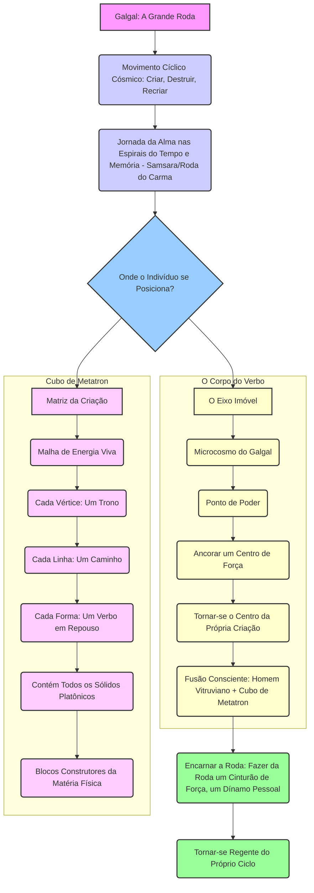

## Mapa de Integração Somato-Energética

Este mapa detalhado integra os conceitos do método "O Corpo do Verbo" e "Zorar Operativo", fornecendo um framework para a compreensão e ativação dos pontos somato-energéticos do corpo humano. Ele interconecta a sabedoria das letras hebraicas, a estrutura da Árvore da Vida, a matriz do Cubo de Metatron e as mensagens arquetípicas do Oráculo OPIS, culminando em protocolos práticos de ativação e harmonização.

### 1. Mapeamento de Pontos de Poder no Corpo Humano Baseado nas Letras Hebraicas

O método "O Corpo do Verbo" considera o corpo como um "Grimório Vivo", onde cada letra hebraica, uma "letra-função" arquetípica, ressoa com um ponto específico do corpo. As práticas somáticas do "Zorar Operativo" visam ativar essas correspondências.

| Letra Hebraica | Nome da Letra | Ponto Corporal Associado (Exemplos) | Função/Significado no Corpo do Verbo |
|---|---|---|---|
| א | Alef | Peito / Respiração | Unidade, Ar, Início, Silêncio, Expansão. |
| ב | Bet | Boca / Fala | Casa, Criação, Dualidade, Manifestação. |
| ג | Guimel | Garganta / Pescoço | Ponte, Conexão, Movimento, Recompensa. |
| ד | Dalet | Mão / Porta | Porta, Entrada, Pobreza, Doação. |
| ה | Hei | Olhos / Visão | Janela, Revelação, Respiração, Expansão. |
| ו | Vav | Coluna Vertebral / Conexão | Gancho, Conexão, União, Ligação. |
| ז | Zain | Pés / Caminhada | Espada, Armadura, Sustento, Movimento. |
| ח | Chet | Coração / Sentimentos | Cerca, Vida, Limite, Proteção. |
| ט | Tet | Útero / Abdômen | Serpente, Bem, Gestação, Oculto. |
| י | Yod | Mãos / Dedos | Mão, Ponto, Semente, Potencial. |
| כ | Kaf | Palma da Mão / Força | Palma, Poder, Abertura, Permissão. |
| ל | Lamed | Rins / Aprendizado | Aguilhão, Aprendizado, Ensinamento. |
| מ | Mem | Água / Fluxo Sanguíneo | Água, Mãe, Fluidez, Caos Primordial. |
| נ | Nun | Nervos / Flexibilidade | Peixe, Semente, Continuidade, Queda. |
| ס | Samech | Baço / Suporte | Suporte, Círculo, Confiança, Proteção. |
| ע | Ain | Olho / Percepção | Olho, Fonte, Percepção, Humildade. |
| פ | Pe | Boca / Expressão | Boca, Fala, Expressão, Abertura. |
| צ | Tsadi | Pulmões / Respiração | Justo, Caça, Humildade, Retidão. |
| ק | Kof | Nuca / Conexão Superior | Nuca, Macaco, Santidade, Atrás. |
| ר | Resh | Cabeça / Razão | Cabeça, Início, Pobreza, Escolha. |
| ש | Shin | Dentes / Fogo | Dente, Fogo, Transformação, Mudança. |
| ת | Tav | Coração / Selo | Cruz, Sinal, Selo, Verdade, Conclusão. |

### 2. Interconexão entre Sistemas Energéticos

A compreensão do corpo como um sistema integrado requer a interconexão de diferentes modelos energéticos.

#### 2.1. Árvore da Vida com Mapeamento Somático

A Árvore da Vida é um mapa da consciência, e no "Corpo do Verbo", suas Sefirot são mapeadas a pontos corporais, transformando o corpo em um "Barômetro da Alma".

| Sefirá (Emanação) | Localização Somática (Corpo Humano) | Significado/Função no Contexto do "Corpo do Verbo" |
|---|---|---|
| **Keter (Coroa)** | Acima da cabeça / Coroa | Conexão com o Divino, Vontade Primordial, Ponto de Essência. |
| **Chokmah (Sabedoria)** | Lado direito do cérebro / Hemisfério direito | Sabedoria intuitiva, insights, potencial criativo. |
| **Binah (Entendimento)** | Lado esquerdo do cérebro / Hemisfério esquerdo | Entendimento, lógica, estrutura, forma. |
| **Chesed (Misericórdia/Amor)** | Braço direito / Lado direito do tronco | Expansão, bondade, amor incondicional. |
| **Gevurah (Julgamento/Força)** | Braço esquerdo / Lado esquerdo do tronco | Restrição, disciplina, força, discernimento. |
| **Tiferet (Beleza/Harmonia)** | Coração / Centro do peito | Equilíbrio, compaixão, beleza, integração. |
| **Netzach (Vitória/Eternidade)** | Perna direita / Quadril direito | Persistência, vitória, emoção, instinto. |
| **Hod (Glória/Esplendor)** | Perna esquerda / Quadril esquerdo | Intelecto, comunicação, razão, lógica. |
| **Yesod (Fundamento)** | Órgãos genitais / Base da coluna | Fundação, reprodução, inconsciente, memória. |
| **Malchut (Reino)** | Pés / Base do corpo | Manifestação, realidade física, ancoragem. |

#### 2.2. Cubo de Metatron e o "Galgal"

O Cubo de Metatron é a matriz estrutural do universo, enquanto o "Galgal" representa o movimento cíclico cósmico. O "Corpo do Verbo" atua como o "Eixo Imóvel" dentro desse ciclo, permitindo ao indivíduo reger sua própria realidade.



#### 2.3. Oráculo OPIS e Pontos Somáticos

O Oráculo OPIS, como ferramenta de diagnóstico, pode ser integrado ao mapeamento somático, associando cada carta a um ponto corporal principal para aprofundar a interpretação.

| Carta Oráculo OPIS (Exemplo de Arquétipo) | Ponto Somático Principal Sugerido | Justificativa (Conexão com "Corpo do Verbo") |
|---|---|---|
| **Ação/Início** | Mãos / Punhos | Capacidade de fazer, iniciar, moldar a realidade. Conecta-se à "Mão" (Yod) como semente e potencial. |
| **Conflito/Desafio** | Plexo Solar / Abdômen | Centro de poder pessoal, onde emoções e tensões podem se manifestar. Relacionado à "Serpente" (Tet) e processos de transformação interna. |
| **Crescimento/Expansão** | Coração / Peito | Centro de emoções, amor e conexão. Associado à "Unidade" (Alef) e à expansão da consciência. |
| **Comunicação/Expressão** | Garganta / Boca | Centro da fala e da expressão. Conecta-se à "Boca" (Pe) e à "Criação" (Bet) através do Verbo. |
| **Fundamento/Estabilidade** | Pés / Base da Coluna | Ancoragem, conexão com a realidade física. Relacionado a "Malchut" (Reino) e à manifestação. |
| **Intuição/Visão** | Olhos / Terceiro Olho | Percepção, insight, clareza. Associado à "Janela" (Hei) e à "Percepção" (Ain). |
| **Transformação/Fim de Ciclo** | Órgãos Reprodutores / Baixo Ventre | Renovação, morte e renascimento. Conecta-se a "Yesod" (Fundamento) e à "Água" (Mem) como fluxo e caos primordial. |
| **Proteção/Limites** | Costas / Coluna Vertebral | Suporte, estrutura, defesa. Relacionado à "Cerca" (Chet) e à "Conexão" (Vav). |
| **Sabedoria/Conhecimento** | Cabeça / Cérebro | Razão, intelecto, compreensão. Associado a "Keter" (Coroa) e "Binah" (Entendimento). |
| **Jornada/Direção** | Pernas / Quadris | Movimento, propósito, caminho. Conecta-se a "Netzach" (Vitória) e "Hod" (Glória) como persistência e intelecto em ação. |

### 3. Protocolos de Ativação e Harmonização dos Pontos Somato-Energéticos

O SCII (Sistema de Codificação de Inteligência Integral) oferece um framework para traduzir informações entre os sistemas simbólicos e guiar a ativação e harmonização.

#### 3.1. Framework de Mapeamento Multidimensional (SCII)

| Domínio | Neuroanatomia/Somático | Letra Hebraica (Ex.) | Ponto Energético (Ex.) | Padrão de Consciência (Ex.) | Ciclo de Manifestação (Ex.) | Oráculo OPIS (Arquétipo Ex.) |
|---|---|---|---|---|---|---|
| **Início/Criação** | Córtex Pré-frontal / Mãos | Alef (Unidade, Início) | Coroa / Mãos | Intenção, Potencial Puro | Início do Ciclo (Semente) | Ação/Início |
| **Expressão/Comunicação** | Laringe / Boca | Pe (Boca, Expressão) | Garganta | Clareza, Verdade | Fase de Expansão | Comunicação/Expressão |
| **Emoção/Conexão** | Sistema Límbico / Coração | Chet (Cerca, Vida) | Coração | Amor, Compaixão | Pico de Manifestação | Crescimento/Expansão |
| **Estrutura/Limites** | Coluna Vertebral / Ossos | Vav (Gancho, Conexão) | Base da Coluna | Disciplina, Ordem | Fase de Consolidação | Proteção/Limites |
| **Transformação/Fim** | Sistema Endócrino / Baixo Ventre | Mem (Água, Fluidez) | Plexo Solar / Sacro | Liberação, Renovação | Fim do Ciclo (Colheita/Morte) | Transformação/Fim de Ciclo |
| **Percepção/Intuição** | Glândula Pineal / Olhos | Ain (Olho, Percepção) | Terceiro Olho | Insight, Visão | Fase de Reflexão | Intuição/Visão |
| **Fundamento/Realidade** | Pés / Sistema Nervoso Periférico | Tav (Sinal, Selo) | Pés / Raiz | Ancoragem, Manifestação | Realização | Fundamento/Estabilidade |

#### 3.2. Algoritmo de Tradução Energética (SCII)

O algoritmo permite converter informações e estados entre os diferentes sistemas simbólicos para diagnóstico e intervenção.

```mermaid
graph TD
    A[Entrada de Dados: Sensação Corporal, Carta OPIS, Pensamento, etc.] --> B{Identificação do Padrão Central / Arquétipo};
    B --> C[Consulta à Tabela de Mapeamento Multidimensional];
    C --> D[Propagação Multidimensional: Neuroanatomia, Letras Hebraicas, Pontos Energéticos, Padrões de Consciência, Ciclos de Manifestação];
    D --> E[Geração de Insights: Significado, Origem, Implicações];
    D --> F[Sugestão de Ações/Práticas (Zorar Operativo)];
    E --> G[Compreensão Aprofundada];
    F --> H[Aplicação Prática];
    H --> I[Observação de Resultados / Feedback];
    I --> A;
```

### 4. Guia Prático de Ativação Somática para Implementação dos Conceitos do "Corpo do Verbo"

Este guia oferece passos práticos para ativar e harmonizar os pontos somato-energéticos, utilizando os princípios do "Corpo do Verbo" e as práticas do "Zorar Operativo".

**Princípios Fundamentais:**

*   **Consciência Corporal:** O corpo é um "Grimório Vivo". Preste atenção às sensações, tensões e fluxos de energia.
*   **Intenção Clara:** Cada prática deve ser guiada por uma intenção específica, seja para harmonizar, ativar ou liberar.
*   **Respiração Consciente:** A respiração é a ponte entre o corpo e o espírito, fundamental para mover a energia.
*   **Visualização:** Use a imaginação para direcionar a energia e o significado das letras hebraicas e arquétipos.
*   **Consistência:** A prática regular, mesmo que breve, é mais eficaz do que sessões esporádicas e intensas.

**Protocolos de Ativação e Harmonização:**

1.  **Diagnóstico Inicial (O GUIA_DA_AUTO_ANALISE e Oráculo OPIS):**
    *   **Autoanálise:** Utilize o "GUIA_DA_AUTO_ANALISE" (referenciado pelo "Zorar Operativo") para identificar padrões, desafios e áreas de foco.
    *   **Oráculo OPIS:** Tire uma carta do Oráculo OPIS para obter um insight arquetípico sobre a situação atual.
    *   **Mapeamento Somático:** Identifique o ponto somático principal associado à carta e observe as sensações nessa área do corpo.

2.  **Ativação da Letra Hebraica Correspondente:**
    *   **Identificação:** Com base no ponto somático e no insight do Oráculo OPIS, consulte a "Tabela de Correspondências entre as 22 Letras Hebraicas e Pontos Corporais" para identificar a letra hebraica relevante.
    *   **Vibração Sonora:** Pronuncie a letra hebraica (ou seu som correspondente) em voz alta ou mentalmente, direcionando a vibração para o ponto corporal associado.
    *   **Visualização:** Visualize a forma da letra hebraica no ponto do corpo, imaginando sua energia e significado se manifestando.
    *   **Exemplo:** Se a carta OPIS for "Comunicação/Expressão" e o ponto somático for a garganta, foque na letra **Pe (פ)**. Pronuncie "Peh" e visualize a boca se abrindo na garganta, liberando a expressão.

3.  **Harmonização da Sefirá da Árvore da Vida:**
    *   **Identificação:** Consulte o "Diagrama da Árvore da Vida com Mapeamento Somático" para identificar a Sefirá associada ao ponto corporal ou ao tema em questão.
    *   **Meditação Focada:** Medite sobre o significado da Sefirá e sua função. Direcione a respiração e a consciência para a área do corpo correspondente.
    *   **Afirmação:** Utilize afirmações que ressoem com a qualidade da Sefirá.
    *   **Exemplo:** Se houver tensão no coração (Tiferet), medite sobre o equilíbrio, a compaixão e a beleza. Respire profundamente no centro do peito e afirme: "Eu sou o equilíbrio e a harmonia."

4.  **Integração com o Cubo de Metatron e o Galgal:**
    *   **Consciência Estrutural:** Ao realizar as práticas, visualize-se como o "Eixo Imóvel" no centro do "Galgal", com a estrutura do Cubo de Metatron ao seu redor.
    *   **Intenção de Regência:** Afirme sua capacidade de reger seu próprio ciclo de manifestação, utilizando a energia das letras e Sefirot.
    *   **Exemplo:** Ao ativar a letra Yod nas mãos para iniciar um projeto, visualize o Cubo de Metatron como a matriz de possibilidades e o Galgal como o ciclo de criação que você está ativando a partir do seu centro.

5.  **Práticas do "Zorar Operativo" (Ações Específicas):**
    *   **Rituais:** Crie pequenos rituais pessoais para consagrar intenções ou liberar energias.
    *   **Práticas Somáticas:** Realize exercícios físicos que ativem os pontos corporais específicos (ex: alongamentos, posturas de yoga, movimentos de dança intuitiva).
    *   **Meditações Ativas:** Utilize visualizações guiadas ou meditações com foco na respiração para programar a mente e alinhar a vontade.
    *   **Alquimia Interna:** Pratique técnicas de respiração e circulação de energia (ex: pranayama, qigong) para transmutar emoções e refinar a consciência.

**Exemplo de Protocolo Integrado (Cenário: Bloqueio na Expressão Criativa):**

1.  **Diagnóstico:**
    *   **Autoanálise:** Identifica um padrão de procrastinação e dificuldade em iniciar projetos.
    *   **Oráculo OPIS:** Tira a carta "Ação/Início".
    *   **Mapeamento Somático:** Sente uma leve tensão nas mãos e ombros.

2.  **Ativação da Letra Hebraica:**
    *   **Letra:** Yod (י) - Mão, Ponto, Semente, Potencial.
    *   **Prática:** Sente-se confortavelmente. Respire profundamente. Ao expirar, pronuncie mentalmente ou sussurre "Yod", visualizando uma pequena semente de luz nas palmas das suas mãos. Ao inspirar, sinta essa luz se expandir. Repita 7 vezes.

3.  **Harmonização da Sefirá:**
    *   **Sefirá:** Malchut (Reino) - Manifestação, ancoragem (associada aos pés, mas a manifestação se estende ao corpo todo). Ou Keter (Coroa) - Vontade Primordial, potencial puro.
    *   **Prática:** Foque na intenção de manifestar sua criatividade. Visualize uma luz dourada descendo de Keter (acima da cabeça) e ancorando em Malchut (pés), passando pelas mãos. Afirme: "Minha vontade criativa se manifesta agora."

4.  **Integração com Cubo de Metatron/Galgal:**
    *   **Prática:** Enquanto respira, visualize-se no centro de um Cubo de Metatron, com cada face representando uma possibilidade criativa. Sinta-se como o "Eixo Imóvel" que ativa o "Galgal" da criação.

5.  **Práticas do "Zorar Operativo":**
    *   **Prática Somática:** Faça um exercício de "sacudir as mãos" para liberar a tensão, seguido de movimentos suaves de "moldar o ar" com as mãos, como se estivesse criando algo invisível.
    *   **Meditação Ativa:** Visualize o projeto criativo já concluído, sentindo a alegria e a satisfação.
    *   **Ritual:** Escreva a intenção criativa em um papel e coloque-o sob uma pedra ou cristal que você considere um "ancorador" de energia.

Este guia é um ponto de partida. A profundidade da experiência virá com a prática contínua, a auto-observação e a personalização dos protocolos de acordo com as necessidades individuais. O objetivo é tornar o corpo um instrumento consciente para a manifestação do Verbo.