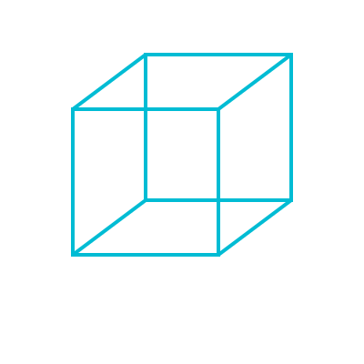
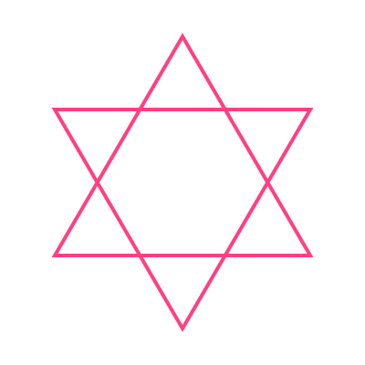
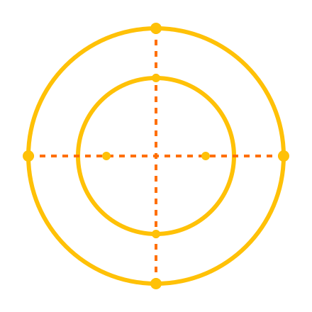

# Incorporando as Fontes Adicionais

## Guia Rápido

1. Estabilize o Cubo (centro do espaço)
2. Ative Chayot como Guardiões (Ezequiel 10)
3. Engrene o Motor Leão–Touro (Ezequiel 1)
4. Module com Serafins (Isaías 6)
5. Direcione com a Águia (Yesod/Netzach/Hod)
6. Converta com Ophanim (rodas internas)
7. Conecte Kether duplo (manifesto/oculto)

Este documento integra camadas tradicionais da Merkavah e correspondências clássicas, expandindo seu sistema com modos de proteção, modulação energética, geometrias e nuances corporais. Use as seções como módulos combináveis em seus protocolos.

---

## Modo Cherubímico: A Merkavah como Sistema de Proteção (Ezequiel 10)

Além do modo “motor” (Ezequiel 1), a visão de Ezequiel 10 apresenta as criaturas como Cherubins guardiões. Isso não contradiz seu modelo — adiciona uma camada de segurança.

Como integrar:
- As Chayot operam em dois modos:
  - Modo Motor (Ezequiel 1): geração de energia/torque
  - Modo Guardião (Ezequiel 10): proteção de limites/limiares

Protocolo expandido:
> “Antes de ativar o torque do motor, estabeleça o campo de proteção cherúbico visualizando as Chayot como guardiões dos quatro quadrantes.”

---

## Camada Serafínica: O Sistema de Purificação (Isaías 6)

Isaías vê Serafins com 6 asas — duas cobrindo o rosto, duas cobrindo os pés, duas para voar. Isto é um sistema de modulação de energia.

Como integrar:
- As “asas extras” funcionam como moduladores de fluxo energético:
  - Asas no rosto: proteção contra excesso de revelação
  - Asas nos pés: grounding da energia divina
  - Asas para voar: mobilidade consciente

Protocolo expandido:
> “Após estabelecer o torque básico, adicione a modulação serafínica: visualize asas protegendo sua consciência (rosto) e ancorando no físico (pés).”

---

## Polaridade Dinâmica: Leão como Chesed OU Gevurah

Sua atribuição (Leão = Chesed) é funcional para expansão. A alternativa (Leão = Gevurah) enfatiza a força contida do leão pronto para atacar.

Solução integrada:
- Leão-expansivo (Chesed): juba radiante, rugido que se expande
- Leão-contrativo (Gevurah): força contida, golpe preciso

Protocolo expandido:
> “Ao invocar o Leão, especifique a polaridade:
> - Para criatividade: Leão-expansivo (Chesed)
> - Para foco/disciplina: Leão-contrativo (Gevurah)”

---

## A Águia Multidimensional (Yesod / Netzach / Hod)

Sua atribuição (Águia = Yesod) é brilhante para a função de “transmissão”. As alternativas tradicionais oferecem nuances:

- Águia = Netzach: velocidade, penetração estratégica
- Águia = Hod: precisão, percepção aguçada

Solução integrada: a Águia opera em três funções
1. Função-Yesod: transmissão base → manifestação
2. Função-Netzach: velocidade de implementação
3. Função-Hod: precisão de percepção

Protocolo expandido:
> “Para projetos: invoque a Águia-Netzach (velocidade). Para discernimento: invoque a Águia-Hod (precisão). Para manifestação: invoque a Águia-Yesod (transmissão).”

---

## O Cubo da Estabilidade vs A Estrela do Movimento

Sua estrela tetraédrica é perfeita para o movimento. O cubo tradicional oferece a estabilidade fundamental.

Solução integrada:
- Cubo: matriz estável, estrutura base
- Estrela tetraédrica: sistema dinâmico, motor de torção

Protocolo expandido:
> “Primeiro estabilize o cubo (visualize-se no centro de um cubo de luz). Então ative a estrela tetraédrica (gire o cubo até revelar a estrela).”

---

## Integrando as Rodas (Ophanim)

Ezequiel descreve “rodas dentro de rodas” como um sistema adicional às Chayot.

Como integrar:
- As rodas funcionam como sistema de transmissão multidimensional — convertem o torque das Chayot em movimento direcional.

Protocolo expandido:
> “Após ativar as Chayot, visualize rodas de luz nos planos horizontal e vertical, convertendo sua energia em movimento direcionado.”

---

## Yesod: Fundação Sexual e Colunar

Veja também: [Volume I – O Alfabeto Operativo (Yesod)](../SCII 5.0/docs/Volume-I-Fundamentos/05_O_Alfabeto_Operativo.md)

Sua correlação (Yesod = coluna) é operativa. A tradição acrescenta Yesod = órgãos sexuais.

Solução integrada: Yesod como sistema de transmissão energética
- Na coluna: transmite força vital
- Nos órgãos sexuais: transmite força criativa

Protocolo expandido:
> “Para trabalhos de energia vital: foque na coluna como Yesod. Para trabalhos criativos: foque no plexo criativo (abaixo do umbigo).”

---

## Kether: Coroa Física e Não-Coroa

Leitura relacionada: [Volume I – O Alfabeto Operativo (Kether)](../SCII 5.0/docs/Volume-I-Fundamentos/05_O_Alfabeto_Operativo.md) e [O SCII – Fluxo de Kether](../SCII 5.0/docs/Volume-I-Fundamentos/04_O_SCII.md)

Sua correlação (Kether = cabeça) é funcional. A tradição complexifica: Kether é “Ain” (Nada), “Não-Cabeça”.

Solução integrada: Kether em dois níveis
1. Kether-manifesto: coroa física, ponto de conexão
2. Kether-oculto: vácuo primordial, potencial puro

Protocolo expandido:
> “Para conexão: visualize luz entrando pela coroa (Kether-manifesto). Para receber inspiração: visualize um vazio acima da cabeça (Kether-oculto).”

---

## Protocolo da Merkavah Expandida (Exemplo)

1. Estabilização Cúbica: visualize-se no centro de um cubo de luz
2. Ativação Cherúbica: visualize as Chayot como guardiões nos 4 quadrantes
3. Ativação do Motor: ative o torque Leão–Touro via respiração
4. Modulação Serafínica: adicione “asas” de proteção e grounding
5. Transmissão Aquilina: direcione a energia via Águia (escolha a função)
6. Ativação das Rodas: visualize rodas convertendo torque em movimento
7. Conexão Coroa-Dual: conecte com Kether-manifesto e receba de Kether-oculto
